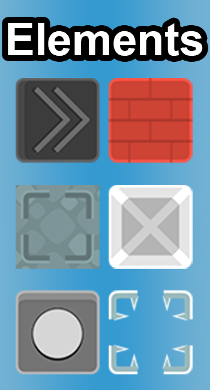
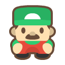
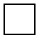
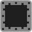

Hi! I'm Herman, a passionate game developer from Ukraine. This is my portfolio game, Soko! Soko is a reimagination of a classic Sokoban game, packed with extra elements for the even greater challenge and more varied player experience.

While maintaining the classic gameplay loop of Sokoban game, Soko adds a whole new sets of conceptions and elements to diversify player's game experience. Below there's a small breakdown of all the concepts alongside with a comprehensive table of all gameplay elements currently present in game.

<table>
  <tr>
    <td style="vertical-align: top; padding-right: 20px;">
      
    </td>
    <td style="vertical-align: top; wight: 200px">
      <table>
        <tr>
          <th>Name</th>
          <th>Icon</th>
          <th>Description</th>
          <th>Name</th>
          <th>Icon</th>
          <th>Description</th>
        </tr>
        <tr>
          <td>Player</td>
          <td></td>
          <td>User-controlled game entity.</td>
          <td>Wall</td>
          <td></td>
          <td>Object unpassable by anything.</td>
        </tr>
        <tr>
          <td>Box</td>
          <td></td>
          <td>Pushable box. Can activate spots.</td>
          <td>Spot</td>
          <td></td>
          <td>Activate all to complete the level.</td>
        </tr>
        <tr>
          <td>Sliding Box</td>
          <td></td>
          <td>This box, while pushed, moves in push direction until something stops it.</td>
          <td>Lock Spot</td>
          <td></td>
          <td>While activated, locks a box in self, preventing it from further movement.</td>
        </tr>
        <tr>
          <td>Fence</td>
          <td></td>
          <td>Allows player movement, but blocks boxes.</td>
          <td>Water</td>
          <td></td>
          <td>Allows box movement, but blocks player.</td>
        </tr>
        <tr>
          <td>Gate Toggle Button</td>
          <td></td>
          <td>When entered, toggles all Togglable Gate states (open to close and vice versa).</td>
          <td>Togglable Gate</td>
          <td></td>
          <td>Can be open or closed. Whle open, acts like empty spot, if closed, acts like a wall</td>
        </tr>
        <tr>
          <td>Color Push Button</td>
          <td></td>
          <td>Always colored. When entered, moves all the boxes of corresponding color in button's direction.</td>
          <td>Teleporter</td>
          <td></td>
          <td>Always colored. When player enters teleporter's spot, it is teleported to another teleporter of the same color.</td>
        </tr>
      </table>
    </td>
  </tr>
</table>

