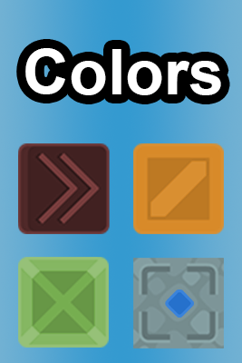
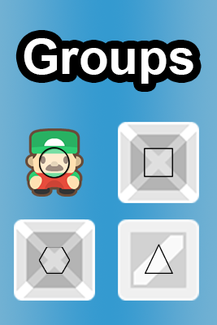

Hi! I'm Herman, a passionate game developer from Ukraine. This is my portfolio game, Soko! Soko is a reimagination of a classic Sokoban game, packed with extra elements for the even greater challenge and more varied player experience.


While maintaining the classic gameplay loop of Sokoban game, Soko adds a whole new sets of conceptions and elements to diversify player's game experience. Below there's a small breakdown of all the concepts alongside with a comprehensive table of all gameplay elements currently present in game.


Currently, Soko features 12 gameplay elements (13 with empty spaces included). Some elements can have colors or be grouped to extend level variety even further. New elements can be easily created with Soko's flexible Component syste which is describeld in "Technical Decisions" section.
<details><summary>Full table of gameplay elements featured in Soko</summary>

  <table>
    <tr>
      <th>Name</th>
      <th>Icon</th>
      <th>Description</th>
      <th>Name</th>
      <th>Icon</th>
      <th>Description</th>
    </tr>
    <tr>
      <td>Player</td>
      <td></td>
      <td>User-controlled game entity.</td>
      <td>Wall</td>
      <td></td>
      <td>Object unpassable by anything.</td>
    </tr>
    <tr>
        <td>Box</td>
        <td></td>
        <td>Pushable box. Can activate spots.</td>
        <td>Spot</td>
        <td></td>
        <td>Activate all to complete the level.</td>
      </tr>
      <tr>
        <td>Sliding Box</td>
        <td></td>
        <td>This box, while pushed, moves in push direction until something stops it.</td>
        <td>Lock Spot</td>
        <td></td>
        <td>While activated, locks a box in self, preventing it from further movement.</td>
      </tr>
      <tr>
        <td>Fence</td>
        <td></td>
        <td>Allows player movement, but blocks boxes.</td>
        <td>Water</td>
        <td></td>
        <td>Allows box movement, but blocks player.</td>
      </tr>
      <tr>
        <td>Gate Toggle Button</td>
        <td></td>
        <td>When entered, toggles all Togglable Gate states (open to close and vice versa).</td>
        <td>Togglable Gate</td>
        <td></td>
        <td>Can be open or closed. Whle open, acts like empty spot, if closed, acts like a wall</td>
      </tr>
      <tr>
        <td>Color Push Button</td>
        <td></td>
        <td>Always colored. When entered, moves all the boxes of corresponding color in button's direction.</td>
        <td>Teleporter</td>
        <td></td>
        <td>Always colored. When player enters teleporter's spot, it is teleported to another teleporter of the same color.</td>
      </tr>
  </table>
</details>


Colors both contribute to the aestetics and gameplay. The idea is simple: only elements of the same color interact with each other.
Not every element can be colored. Walls, Fences, Water and Player do not have colors.
For elements like Color Push Button color is mandatory. Other elements (like Boxes) can have or not have a color.
White color is a color wildcard and can be used to substitute any of them.
<br/><br/>
<br/><br/>


Groups is a concept related to simultaneous movement of objects. Objects united in a same group will move if any of these objects are about to move. Also, movement possibility will be checked for the whole group.	
	Even objects of different type can be a part of the group. Rules for these hybrid sets are something player is meant to discover, however each individal element always behaves consistently, disregarding of being part of the group.
 <br/><br/>
<br/><br/>


# <ins>Movement System</ins>
Movement rules for all the game elements are consistent and centralized in MoveManager, with a minimum amount of hardcode and corner-cases. Movement system is designed to be easily expandable with new elements and is capable of handling even complex cases of movement (like, player is pushing a boxes group and entering a portal).

### <ins>A brief breakdown of movement rules</ins>

Before movement starts, all objects participating in movement are found. The **first participant** is always an object whose movement was caused by user (Player in our case, but another ones could be added in future). Then, the movement tile is checked and if there's a movable object, it is also registered as a participant. Then, both moved object and **first participant** call their ```GetSubsequentObjects``` to find all objects the movement of which will be caused by the movement of the main object (now, only the Group Movement is a case).

For each object, a ```MoveAction``` is generated. If object cannot move due to various reasons (edge/wall reached, grouped object movement is blocked etc), it's movement action's ```IsInterrupted``` is set to true. **If all object's MoveActions have their IsInterrupted set to true, movement is considered finished**. 

Movement is split into iterations, each iteration handling movement for for tile in any direction. On each iteration, ```OnMoveStarted``` is called for each object which ```MoveAction.Started``` is false, and ```OnMoveFinished``` is called for each object, which ```MoveAction.Interrupted``` is true and ```MoveAction.Finished``` is false.

There are several overridable methods to customize behaviour of the objects: ```MovementRulesComponent.CheckCanMove```, ```MovementRulesComponent.CheckBoundObjectsAllowMove```, ```LevelObjectComponent.CheckObjectEnter``` and others.

There are three types of movement on the code level: **Regular Movement**, **Teleportation** and **Delayed Movement**.
- **Regular Movement** is the simple movement of objects. Player, Boxes etc are using regular movement when moved/pushed.
- **Teleportation** is the unique case of movement, always executed after the all regular movement was finished.
- **Delayed Movement** is used if something during regular movement execution led to another objects movenent. For example, if player pushes a box on the Color Push Button, he will enter the button cell, causing all the colored boxes to move in the direction button shows. This movement will be executed _after_ all the movement caused by player pushing box (including all the grouped boxes) finishes.

# Component System

